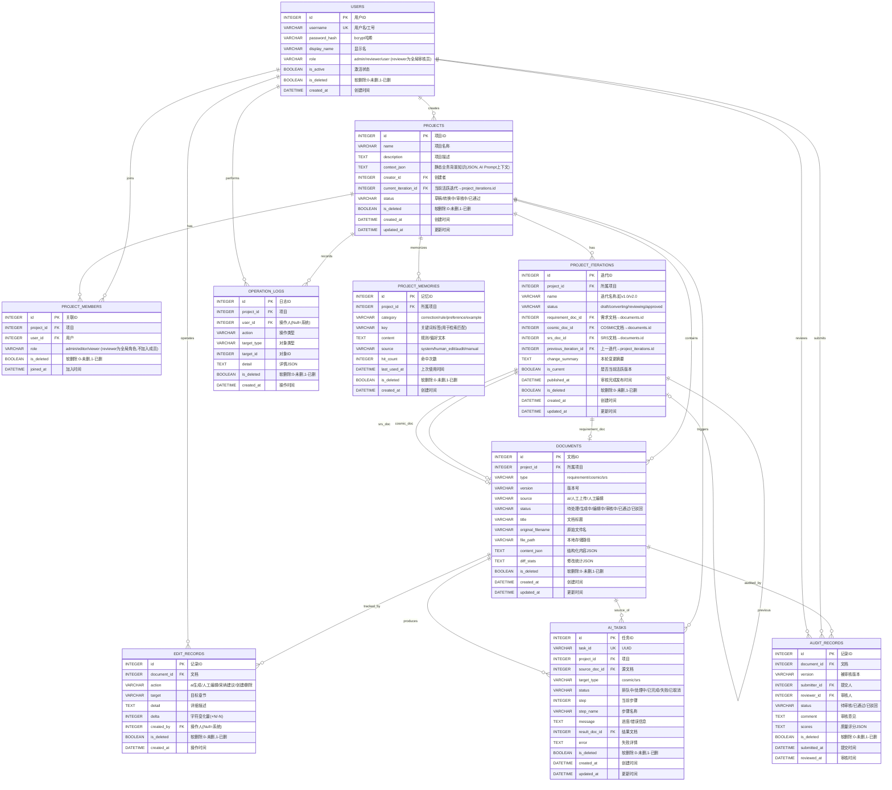

# COSMIC 智能文档转换平台 — E-R 图

> **说明**: 本文档使用 Mermaid `erDiagram` 语法描述 COSMIC 平台完整数据模型。  
> **对应 DDL**: `docs/ddl.sql`（SQLite）

---

## 完整 E-R 图

---

## 关系说明

### 1. 用户与项目

| 关系 | 基数 | 业务含义 |
|------|------|----------|
| `USERS -- PROJECTS` | 1:N | 一个用户可以创建多个项目 |
| `USERS -- PROJECT_MEMBERS` | 1:N | 一个用户可以加入多个项目 |
| `PROJECTS -- PROJECT_MEMBERS` | 1:N | 一个项目可以拥有多个成员 |

### 2. 项目与迭代与文档

| 关系 | 基数 | 业务含义 |
|------|------|----------|
| `PROJECTS -- PROJECT_ITERATIONS` | 1:N | 一个项目拥有多个迭代版本（v1.0、v2.0...） |
| `PROJECT_ITERATIONS -- DOCUMENTS` | 1:1×3 | 一个迭代通过三个 FK 关联各自的需求/COSMIC/SRS 文档（反向引用，避免鸡生蛋） |
| `PROJECTS -- DOCUMENTS` | 1:N | 一个项目包含全部历史文档（DOCUMENTS 仍保留 project_id） |
| `DOCUMENTS -- EDIT_RECORDS` | 1:N | 一份文档拥有多条编辑记录（修改追踪） |
| `DOCUMENTS -- AUDIT_RECORDS` | 1:N | 一份文档经历多轮审核 |

### 3. AI 转换任务

| 关系 | 基数 | 业务含义 |
|------|------|----------|
| `PROJECTS -- AI_TASKS` | 1:N | 一个项目可触发多次转换任务 |
| `DOCUMENTS -- AI_TASKS` | 1:2 | 一份文档既是任务的**源文档**(source)，也可能是**结果文档**(result) |

### 4. 操作日志

| 关系 | 基数 | 业务含义 |
|------|------|----------|
| `PROJECTS -- OPERATION_LOGS` | 1:N | 记录项目内的所有业务操作 |
| `USERS -- OPERATION_LOGS` | 1:N | 记录用户发起的操作 |

### 5. 迭代记忆

| 关系 | 基数 | 业务含义 |
|------|------|----------|
| `PROJECTS -- PROJECT_MEMORIES` | 1:N | 一个项目可积累多条 AI 迭代修正记忆（随版本迭代增长） |

**记忆数据来源**：
- **自动提炼**：用户保存编辑器内容时，系统对比 AI 原始输出与修改后差异，调用 LLM 提炼规则
- **审核触发**：审核驳回时，审核意见自动提炼为记忆条目
- **手动添加**：用户在「项目设置 > AI 偏好」中手动编写硬规则

---

## 核心约束检查清单

| 约束 | 实现位置 | 说明 |
|------|----------|------|
| 每个项目最多每种类型一份当前文档 | 应用层 | `documents(project_id, type)` 由业务代码保证唯一性 |
| 项目创建者自动成为管理员 | 应用层 | 创建项目时同步插入 `project_members` 记录，role=`admin` |
| 审核员不可审核自己提交的文档 | 应用层 | `submitter_id != reviewer_id` 在提交审核时校验 |
| 一个项目仅有一个当前迭代 | 应用层 | `is_current=1` 在项目范围内唯一，通过 `UPDATE` 重置其他迭代的 `is_current=0` |
| 项目状态自动同步自当前迭代 | 应用层 | `projects.status` 由 `current_iteration.status` 驱动，不直接修改 |
| 软删除（保留历史） | **数据库+应用层** | 所有表均有 `is_deleted` 字段，查询时默认过滤 `is_deleted=0`；删除操作实为 UPDATE `is_deleted=1` |

---

## 索引速查

| 索引名 | 表 | 字段 | 用途 |
|--------|-----|------|------|
| `idx_users_username` | users | username | 登录查询 |
| `idx_projects_creator` | projects | creator_id | 我创建的项目列表 |
| `idx_projects_status` | projects | status | 按状态筛选 |
| `idx_projects_current` | projects | current_iteration_id | 当前迭代查询 |
| `idx_pmembers_project` | project_members | project_id | 项目成员列表 |
| `idx_iter_project` | project_iterations | project_id | 项目迭代列表 |
| `idx_iter_current` | project_iterations | is_current | 查找当前迭代 |
| `idx_iter_status` | project_iterations | status | 按迭代状态筛选 |
| `idx_iter_previous` | project_iterations | previous_iteration_id | 迭代溯源 |
| `idx_docs_project` | documents | project_id | 项目文档列表 |
| `idx_docs_type` | documents | type | 按类型筛选 |
| `idx_edit_doc` | edit_records | document_id | 文档编辑历史 |
| `idx_audit_doc` | audit_records | document_id | 文档审核历史 |
| `idx_aitask_task_id` | ai_tasks | task_id | 任务状态查询 |
| `idx_oplog_project` | operation_logs | project_id | 项目操作日志 |
| `idx_memo_project` | project_memories | project_id | 项目记忆列表 |
| `idx_memo_key` | project_memories | key | 关键词检索记忆 |
| `idx_memo_category` | project_memories | category | 按类别筛选记忆 |
